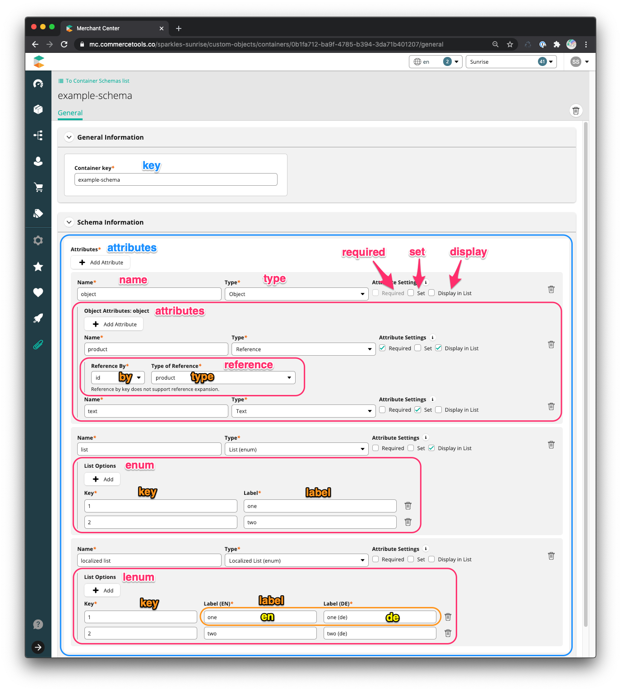
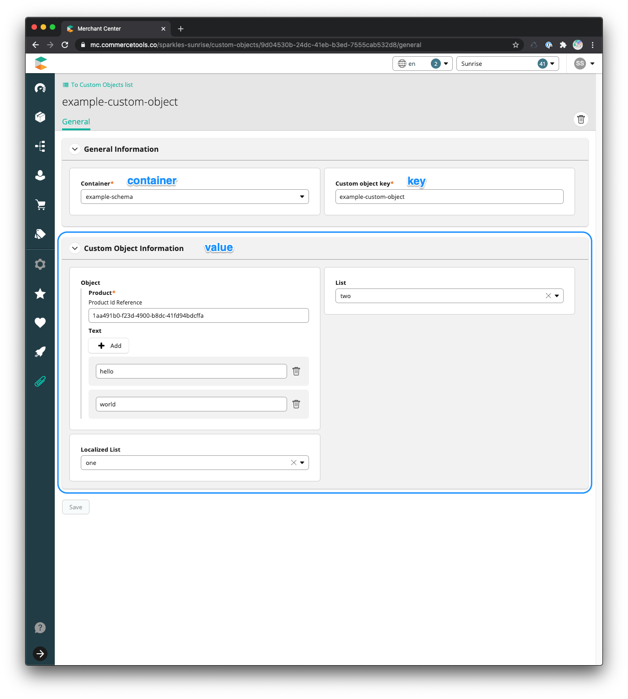

<!--prettier-ignore-start-->
## Data Model
{: .no_toc }

1. TOC 
{:toc}

<!--prettier-ignore-end-->

### Container Schema

Container schemas are
[Custom Objects](https://docs.commercetools.com/http-api-projects-custom-objects).

- **container** -
  [`mc-custom-object-schema`](https://github.com/commercetools/commercetools-mc-custom-objects-starter/blob/89382c773b420756f55f06a583baf6d6e18f1597/src/constants.js#L7)
- **key** - String, matching the pattern `[-_~.a-zA-Z0-9]+` - Required
- **value** - Object
  - **attributes** - Array of [Attribute](#attribute) - Required

<!--prettier-ignore-start-->
#### Attribute
{: .no_toc }
<!--prettier-ignore-end-->

- **name** - String - Required\
  Displayed in [start case](https://lodash.com/docs/4.17.15#startCase) in the Custom
  Object form as form field titles. Saved in schema as [kebab case](https://lodash.com/docs/4.17.15#kebabCase).
- **type** - [Type](#type) - Required\
  The type of the attribute. Determines the Custom Object form field input type.
- **set** - Boolean\
  Flag indicating if the attribute is an array/set.
- **required** - Boolean\
  Flag indicating if the attribute is required.
- **display** - Boolean\
  Flag indicating if the attribute should be displayed in the [Custom Object List](#custom-object-list)
  Value column
- **attributes** - Array of [Attribute](#attribute) - Required when `type` is
  Object
- **reference** - [Reference](#reference) - Required when `type` is Reference
- **enum** - Array of [Enum](#enum) - Required when `type` is List (enum)
- **lenum** - Array of [LocalizedEnum](#localizedenum) - Required when `type` is
  Localized List (enum)

<!--prettier-ignore-start-->
#### Type
{: .no_toc }
<!--prettier-ignore-end-->

List of available types.

- Text
- [Localized Text](https://docs.commercetools.com/http-api-types#localizedstring)
- Number
- Boolean
- [Money](https://docs.commercetools.com/http-api-types#money)
- [Date](https://docs.commercetools.com/http-api-types#date)
- [Time](https://docs.commercetools.com/http-api-types#time)
- [Date and time](https://docs.commercetools.com/http-api-types#datetime)
- List (enum)
- Localized List (enum)
- [Reference](https://docs.commercetools.com/http-api-types#resourceidentifier)
  by ID or key
- Object

<!--prettier-ignore-start-->
#### Reference
{: .no_toc }
<!--prettier-ignore-end-->

- **by** - Enum (id, key)
- **type** -
  [ReferenceType](https://docs.commercetools.com/http-api-types#referencetype)

<!--prettier-ignore-start-->
#### Enum
{: .no_toc }
<!--prettier-ignore-end-->

- **value** - String - Required
- **label** - String - Required\
  The display text.

<!--prettier-ignore-start-->
#### LocalizedEnum
{: .no_toc }
<!--prettier-ignore-end-->

- **value** - String - Required
- **label** -
  [LocalizedString](https://docs.commercetools.com/http-api-types#localizedstring) -
  Required



<!--prettier-ignore-start-->
#### Example Data
{: .no_toc }
<!--prettier-ignore-end-->

```json
{
  "id": "0b1fa712-ba9f-4785-b394-3da71b401207",
  "version": 1,
  "container": "mc-custom-object-schema",
  "key": "example-schema",
  "value": {
    "attributes": [
      {
        "attributes": [
          {
            "display": true,
            "reference": { "type": "product", "by": "id" },
            "required": true,
            "set": false,
            "type": "Reference",
            "name": "product"
          },
          { "required": false, "set": true, "type": "String", "name": "text" }
        ],
        "display": false,
        "required": false,
        "set": false,
        "type": "Object",
        "name": "object"
      },
      {
        "display": true,
        "enum": [
          { "label": "one", "value": "1" },
          { "label": "two", "value": "2" }
        ],
        "required": false,
        "set": false,
        "type": "Enum",
        "name": "list"
      },
      {
        "lenum": [
          { "label": { "de": "one (de)", "en": "one" }, "value": "1" },
          { "label": { "de": "two (de)", "en": "two" }, "value": "2" }
        ],
        "required": false,
        "set": false,
        "type": "LocalizedEnum",
        "name": "localized list"
      }
    ]
  },
  "createdAt": "2020-09-02T15:25:52.545Z",
  "lastModifiedAt": "2020-09-02T15:25:52.545Z",
  "lastModifiedBy": {
    "isPlatformClient": true,
    "user": { "typeId": "user", "id": "f2303e24-a06c-458c-8986-363b8cf208c4" }
  },
  "createdBy": {
    "isPlatformClient": true,
    "user": { "typeId": "user", "id": "f2303e24-a06c-458c-8986-363b8cf208c4" }
  }
}
```

### Custom Object

- **container** - String\
  The key of a [container schema](#container-schema).
- **key** - String, matching the pattern `[-_~.a-zA-Z0-9]+` - Required
- **value** - Object\
  Dynamically determined based on the schema's attributes. The object's keys are
  the [attribute's](#attribute) name in [kebab case](https://lodash.com/docs/4.17.15#kebabCase).



<!--prettier-ignore-start-->
#### Example Data
{: .no_toc }
<!--prettier-ignore-end-->

```json
{
  "id": "9d04530b-24dc-41eb-b3ed-7555cab532d8",
  "version": 1,
  "container": "example-schema",
  "key": "example-custom-object",
  "value": {
    "localizedList": "1",
    "list": "2",
    "object": {
      "text": ["hello", "world"],
      "product": {
        "id": "1aa491b0-f23d-4900-b8dc-41fd94bdcffa",
        "typeId": "product"
      }
    }
  },
  "createdAt": "2020-09-02T15:28:57.702Z",
  "lastModifiedAt": "2020-09-02T15:28:57.702Z",
  "lastModifiedBy": {
    "isPlatformClient": true,
    "user": { "typeId": "user", "id": "f2303e24-a06c-458c-8986-363b8cf208c4" }
  },
  "createdBy": {
    "isPlatformClient": true,
    "user": { "typeId": "user", "id": "f2303e24-a06c-458c-8986-363b8cf208c4" }
  }
}
```
