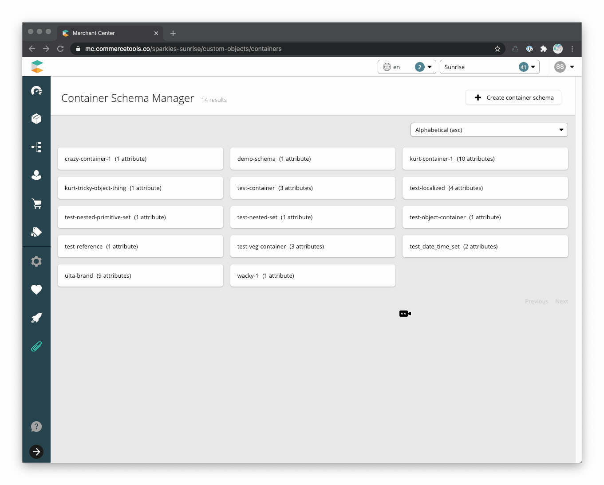
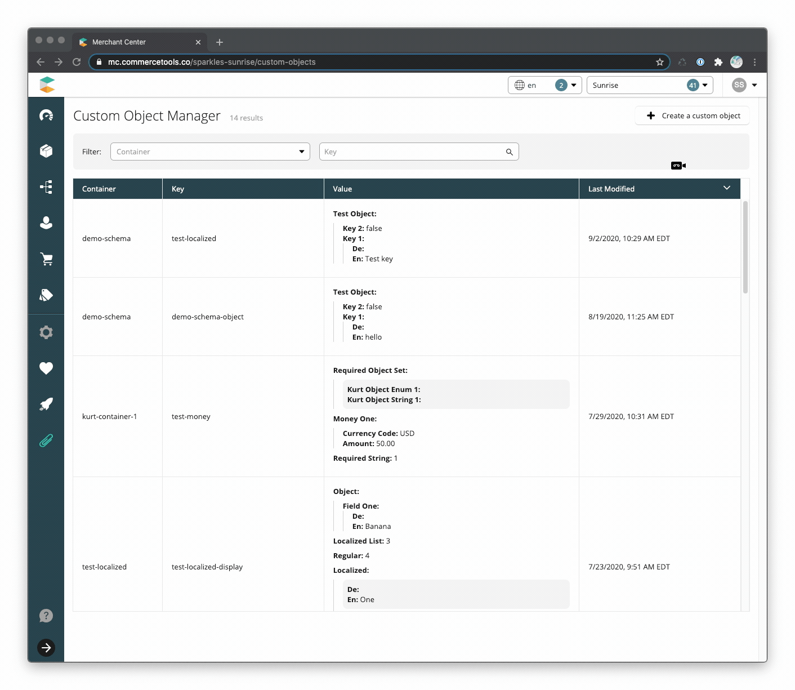

<!--prettier-ignore-start-->
## Features
{: .no_toc }

1. TOC 
{:toc}

<!--prettier-ignore-end-->

### Container Schema List

A grid displaying the container schemas within the commercetools project.

- Pagination
  - [Default page size](https://github.com/commercetools/commercetools-mc-custom-objects-starter/blob/f4ca9b17b9b554c0c4ed68a845e0b01dad80b219/src/components/container-list/constants.js#L8)
    of 15
  - Enabled when the number of schemas exceeds the page size
- Sorting
  - Sortable values are schema key, last modified date, and created date
  - [Initial sort](https://github.com/commercetools/commercetools-mc-custom-objects-starter/blob/f4ca9b17b9b554c0c4ed68a845e0b01dad80b219/src/components/container-list/container-list.js#L51)
    is key in ascending order (alphabetical)

### Container Schema Management

By default, Custom Objects have no defined schema with their value consisting of
a JSON string. This application introduces a schema definition where the user
defines the fields and requirements for building a new custom object. Each
namespace has its own schema definition.

- Create and edit container schemas
- Allows for primitive data as well as sets/arrays
- Attribute types
  - Text
  - Localized Text
  - Number
  - Boolean
  - Money
  - Date
  - Time
  - Date and time
  - List (enum)
  - Localized List (enum)
  - Reference by ID or key
  - Object
- Choose which attributes(s) are displayed in the Value column of the
  [Custom Object List](#custom-object-list) by selecting "Display in List"
- Schemas can be modified to add or delete attributes

### Custom Object List

The landing page for the Custom Objects custom application is a list displaying
the managed Custom Objects within the commercetools project and ignores API
managed namespaces.

- Pagination
  - [Default page size](https://github.com/commercetools/commercetools-mc-custom-objects-starter/blob/aa1d8c00b0a26359b7ec006ca286877a992651e5/src/components/custom-objects-list/constants.js#L16)
    of 20,
  - Displayed when the number of Custom Objects exceeds the page size
- Sorting
  - Sortable columns are Container, Key, and Last Modified
  - [Initial sort](https://github.com/commercetools/commercetools-mc-custom-objects-starter/blob/aa1d8c00b0a26359b7ec006ca286877a992651e5/src/components/custom-objects-list/custom-objects-list.js#L47)
    is Last Modified in descending order (most recently modified first)
- Filter by Custom Object container and key (exact match)
- Attributes displayed in the Value column are managed by the Custom Object's
  schema. If no attributes have been flagged for display, the entire Custom
  Object value is displayed.

### Custom Object Management

- Create and edit Custom Objects with managed schemas
- Field level validation for types and required fields
- Localized fields default to locales defined in the project settings

### Limitations

This application only displays Custom Objects created with a schema managed by
this application. Custom Objects created through the API without a schema are
not displayed.
