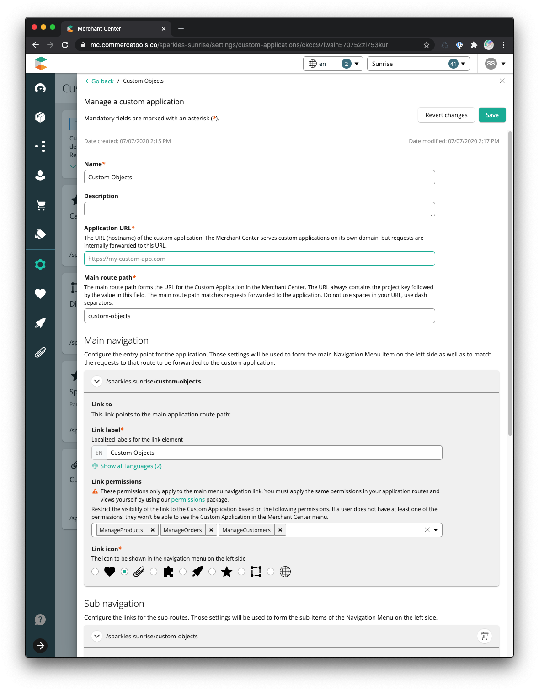
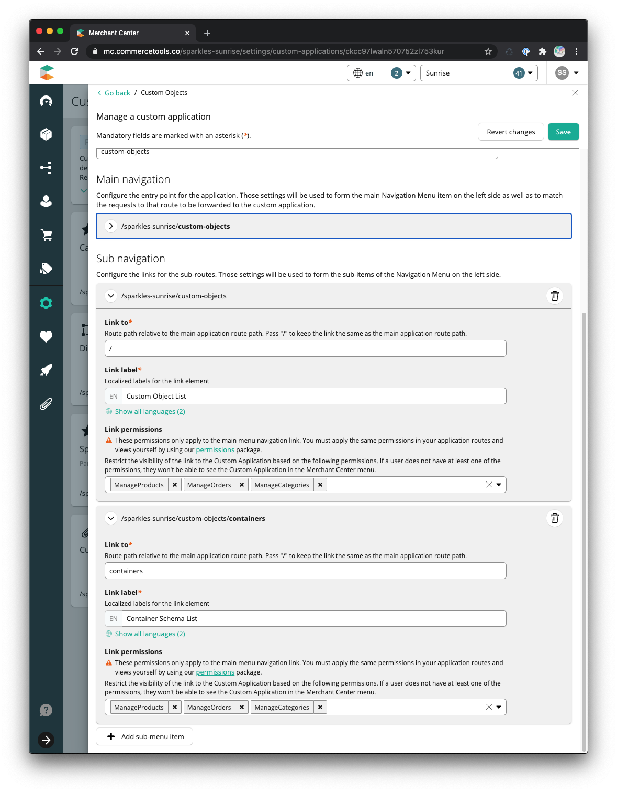

<!--prettier-ignore-start-->
# Custom Objects Editor
{: .fs-9 }

A starter custom application for building a custom object editor within the commercetools' Merchant Center.
{: .fs-6 .fw-300 }

commercetools offers unparalleled data configuration; however, there are
situations where a company needs to store information that does not fit neatly
into an existing endpoint. In these situations, commercetools offers a generic
endpoint - [Custom Objects](https://docs.commercetools.com/http-api-projects-custom-objects).
Custom Objects are a great way to store your JSON data. Some example use-cases may include 
brand data, company profiles, shared product data, and feature flags.

This application extends the commercetools Merchant Center to allow an end-user to define
a JSON data schema and Create, Read, Update, and Delete objects tied to that schema.

_Always speak with a commercetools professional when modeling your data._

[Get started now](#getting-started){: .btn .btn-primary .fs-5 .mb-4 .mb-md-0 .mr-2 } [View it on GitHub](https://github.com/commercetools/commercetools-mc-custom-objects-starter){: .btn .fs-5 .mb-4 .mb-md-0 }

---


## Getting started
### Installation

Clone the repository.

Simply run `yarn` or `yarn install` from the repository root to install the
application's dependencies.

```bash
yarn
```

Run local

```bash
yarn start
```

### Build & Deployment

Run the following command to build the
[production bundles](https://docs.commercetools.com/custom-applications/deployment/production-build)
with webpack:

```bash
yarn build
```

The application includes configuration for both AWS (S3 & CloudFront) and
Firebase serverless deployments built with `mc-script compile-html`.

- [Firebase](https://appkit.commercetools.com/deployment/example-firebase):
  `yarn compile-html:firebase`
- [AWS - S3 & CloudFront](https://appkit.commercetools.com/deployment/example-aws-s3-cloudfront):
  `yarn compile-html:aws`

For either deployment option, the corresponding `production-{cloud}.env.json`
and `production-{cloud}.headers.json` files must be modified with values that
match your deployment environment.

### Registration with Merchant Center

After deploying the custom application, it needs to be
[registered](https://docs.commercetools.com/custom-applications/register-applications/configuring-a-custom-application)
with a Merchant Center project.

<!--prettier-ignore-start-->
#### Configuration Values
{: .no_toc }
<!--prettier-ignore-end-->

- **Main Route Path**: `custom-objects`
- **Link Permissions**: Manage Products, Manage Orders, Manage Customers
- **Sub Navigation** _(Optional)_
  - Custom Object List
    - **Link To**: `/`
    - **Link Permissions**: Manage Products, Manage Orders, Manage Customers
  - Container Schema List
    - **Link To**: `containers`
    - **Link Permissions**: Manage Products, Manage Orders, Manage Customers




---

## License

[MIT license](https://github.com/commercetools/commercetools/commercetools-mc-custom-objects-starter/LICENSE.txt).

## Contributing

When contributing to this repository, please first discuss the change you wish
to make through a new issue. Changes that are business or company specific
should not be merged into this repository.

### Thank you to the contributors!

<ul class="list-style-none">

  <li class="d-inline-block mr-1">
     <a href="{{ contributor.html_url }}"></a>
  </li>

</ul>

#### Disclaimer

Please note: all tools / scripts in this repository are released for use "AS IS"
without any warranties of any kind, including, but not limited to their
installation, use, or performance. We disclaim any and all warranties, either
express or implied, including but not limited to any warranty of
noninfringement, merchantability, and/ or fitness for a particular purpose. We
do not warrant that the technology will meet your requirements, that the
operation thereof will be uninterrupted or error-free, or that any errors will
be corrected.

Any use of these scripts and tools is at your own risk. There is no guarantee
that they have been through thorough testing in a comparable environment and we
are not responsible for any damage or data loss incurred with their use.

You are responsible for reviewing and testing any scripts you run _thoroughly_
before use in any non-testing environment.

## Support

Need help with your project? Contact the Professional Services team for
assistance.
