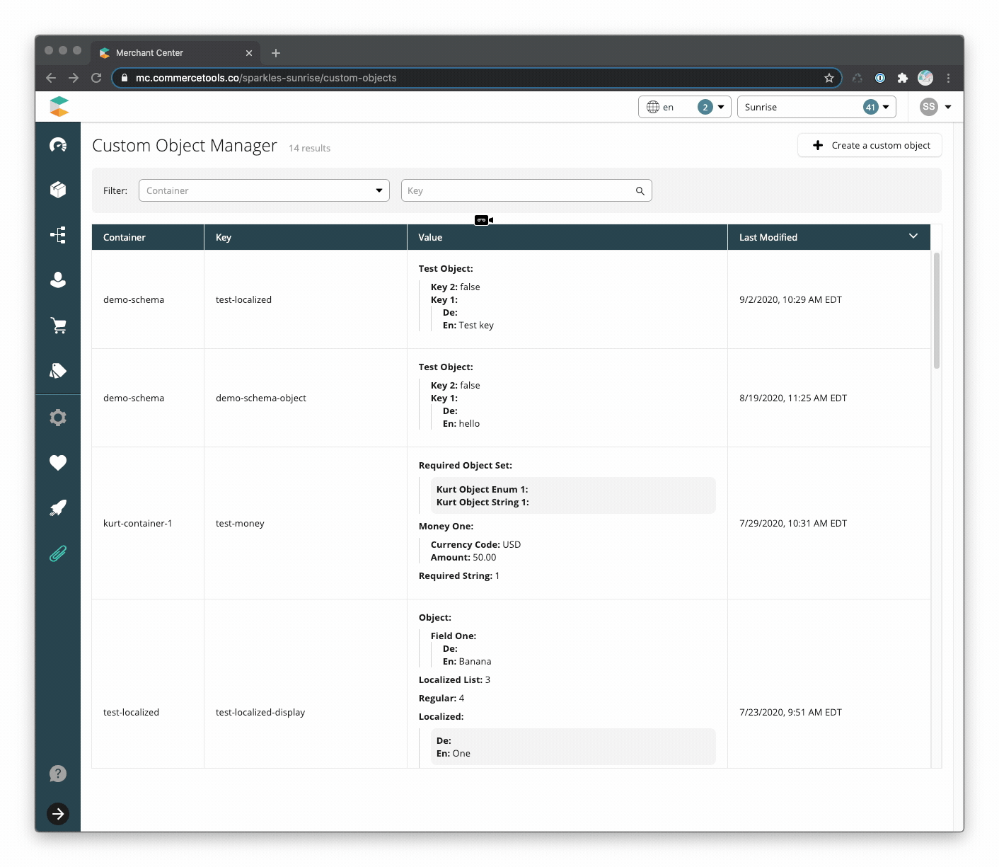
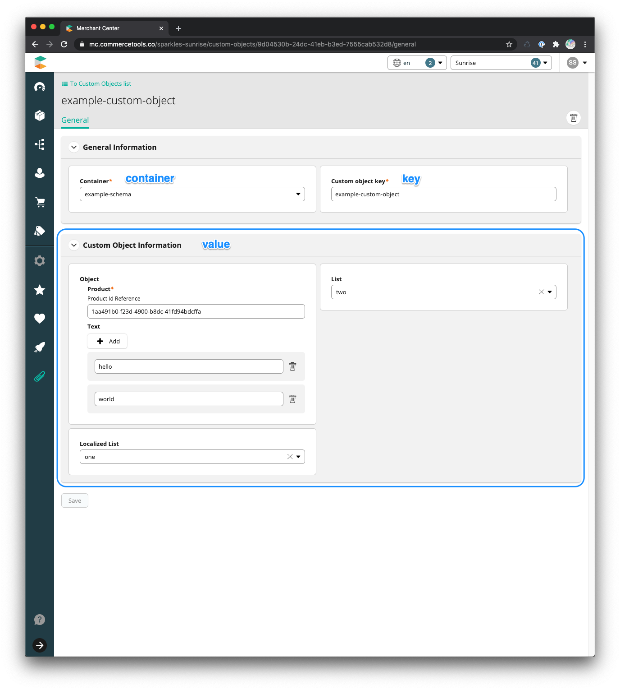

<!--prettier-ignore-start-->
# Custom Objects
{: .no_toc }

## Table of contents
{: .no_toc .text-delta }
<!--prettier-ignore-end-->

<!--prettier-ignore-->
1. TOC 
{:toc}

## Application Overview

commercetools offers unparalleled data configuration; however, there are
situations where a company needs to store information that does not fit neatly
into an existing endpoint. In these situations, commercetools offers a generic
endpoint called
[Custom Objects](https://docs.commercetools.com/http-api-projects-custom-objects).
Custom Objects are a great way to store JSON data partitioned into separate
namespaces. Some example use-cases include store data, company profiles, shared
product data, and feature flags.

When managed through the commercetools API, Custom Object values are not
validated with their value consisting of a JSON string. This Custom Application
enables the creation of Custom Object schemas, which are then used to create and
manage Custom Objects that are validated against a defined schema.

## Technology

- [ReactJS](https://reactjs.org/)
- [Apollo](https://www.apollographql.com/docs/react/) &
  [GraphQL](https://graphql.org/learn/)
- [Merchant Center Application Kit](https://docs.commercetools.com/custom-applications/)
- [UI Kit](https://uikit.commercetools.com/?path=/story/introduction--getting-started) -
  Merchant Center component library
- [Yarn](https://classic.yarnpkg.com/en/docs/getting-started) - Package manager
- [Jest](https://jestjs.io/docs/en/getting-started) - Test runner
- [Enzyme](https://enzymejs.github.io/enzyme/) - React testing utility
- [Prettier](https://prettier.io/docs/en/index.html) - Code formatter
- [ESLint](https://eslint.org/docs/user-guide/getting-started) - JS, CSS, and
  GraphQL linter

## Limitations

This application only displays Custom Objects created with a schema managed by
this application. Custom Objects created through the API without a schema are
not displayed.

## Features

### Container Schema List

A grid displaying the container schemas within the commercetools project.


- Pagination
  - [Default page size](https://github.com/commercetools/mc-custom-app-custom-objects/blob/f4ca9b17b9b554c0c4ed68a845e0b01dad80b219/src/components/container-list/constants.js#L8)
    of 15
  - Enabled when the number of schemas exceeds the page size
- Sorting
  - Sortable values are schema key, last modified date, and created date
  - [Initial sort](https://github.com/commercetools/mc-custom-app-custom-objects/blob/f4ca9b17b9b554c0c4ed68a845e0b01dad80b219/src/components/container-list/container-list.js#L51)
    is key in ascending order (alphabetical)

### Container Schema Management

By default, Custom Objects have no defined schema with their value consisting of
a JSON string. This application introduces a schema definition where the user
defines the fields and requirements for building a new custom object. Each
namespace has its own schema definition.


- Create and edit container schemas
- Allows for primitive data as well as sets/arrays
- Attribute types
  - Text
  - Localized Text
  - Number
  - Boolean
  - Money
  - Date
  - Time
  - Date and time
  - List (enum)
  - Localized List (enum)
  - Reference by ID or key
  - Object
- Choose which attributes(s) are displayed in the Value column of the
  [Custom Object List](#custom-object-list) by selecting "Display in List"
- Schemas can be modified to add or delete attributes

### Custom Object List

The landing page for the Custom Objects custom application is a list displaying
the managed Custom Objects within the commercetools project and ignores API
managed namespaces.


- Pagination
  - [Default page size](https://github.com/commercetools/mc-custom-app-custom-objects/blob/aa1d8c00b0a26359b7ec006ca286877a992651e5/src/components/custom-objects-list/constants.js#L16)
    of 20,
  - Displayed when the number of Custom Objects exceeds the page size
- Sorting
  - Sortable columns are Container, Key, and Last Modified
  - [Initial sort](https://github.com/commercetools/mc-custom-app-custom-objects/blob/aa1d8c00b0a26359b7ec006ca286877a992651e5/src/components/custom-objects-list/custom-objects-list.js#L47)
    is Last Modified in descending order (most recently modified first)
- Filter by Custom Object container and key (exact match)
- Attributes displayed in the Value column are managed by the Custom Object's
  schema. If no attributes have been flagged for display, the entire Custom
  Object value is displayed.

### Custom Object Management



- Create and edit Custom Objects with managed schemas
- Field level validation for types and required fields
- Localized fields default to locales defined in the project settings

## Data Model

### Container Schema

Container schemas are
[Custom Objects](https://docs.commercetools.com/http-api-projects-custom-objects).

- **container** -
  [`mc-custom-object-schema`](https://github.com/commercetools/mc-custom-app-custom-objects/blob/89382c773b420756f55f06a583baf6d6e18f1597/src/constants.js#L7)
- **key** - String, matching the pattern `[-_~.a-zA-Z0-9]+` - Required
- **value** - Object
  - **attributes** - Array of [Attribute](#attribute) - Required

<!--prettier-ignore-start-->
#### Attribute
{: .no_toc }
<!--prettier-ignore-end-->

- **name** - String - Required\
  Displayed in [start case](https://lodash.com/docs/4.17.15#startCase) in the Custom
  Object form as form field titles. Saved in schema as [kebab case](https://lodash.com/docs/4.17.15#kebabCase).
- **type** - [Type](#type) - Required\
  The type of the attribute. Determines the Custom Object form field input type.
- **set** - Boolean\
  Flag indicating if the attribute is an array/set.
- **required** - Boolean\
  Flag indicating if the attribute is required.
- **display** - Boolean\
  Flag indicating if the attribute should be displayed in the [Custom Object List](#custom-object-list)
  Value column
- **attributes** - Array of [Attribute](#attribute) - Required when `type` is
  Object
- **reference** - [Reference](#reference) - Required when `type` is Reference
- **enum** - Array of [Enum](#enum) - Required when `type` is List (enum)
- **lenum** - Array of [LocalizedEnum](#localizedenum) - Required when `type` is
  Localized List (enum)

<!--prettier-ignore-start-->
#### Type
{: .no_toc }
<!--prettier-ignore-end-->

List of available types.

- Text
- [Localized Text](https://docs.commercetools.com/http-api-types#localizedstring)
- Number
- Boolean
- [Money](https://docs.commercetools.com/http-api-types#money)
- [Date](https://docs.commercetools.com/http-api-types#date)
- [Time](https://docs.commercetools.com/http-api-types#time)
- [Date and time](https://docs.commercetools.com/http-api-types#datetime)
- List (enum)
- Localized List (enum)
- [Reference](https://docs.commercetools.com/http-api-types#resourceidentifier)
  by ID or key
- Object

<!--prettier-ignore-start-->
#### Reference
{: .no_toc }
<!--prettier-ignore-end-->

- **by** - Enum (id, key)
- **type** -
  [ReferenceType](https://docs.commercetools.com/http-api-types#referencetype)

<!--prettier-ignore-start-->
#### Enum
{: .no_toc }
<!--prettier-ignore-end-->

- **value** - String - Required
- **label** - String - Required\
  The display text.

<!--prettier-ignore-start-->
#### LocalizedEnum
{: .no_toc }
<!--prettier-ignore-end-->

- **value** - String - Required
- **label** -
  [LocalizedString](https://docs.commercetools.com/http-api-types#localizedstring) -
  Required


<!--prettier-ignore-start-->
#### Example Data
{: .no_toc }
<!--prettier-ignore-end-->

```json
{
  "id": "0b1fa712-ba9f-4785-b394-3da71b401207",
  "version": 1,
  "container": "mc-custom-object-schema",
  "key": "example-schema",
  "value": {
    "attributes": [
      {
        "attributes": [
          {
            "display": true,
            "reference": { "type": "product", "by": "id" },
            "required": true,
            "set": false,
            "type": "Reference",
            "name": "product"
          },
          { "required": false, "set": true, "type": "String", "name": "text" }
        ],
        "display": false,
        "required": false,
        "set": false,
        "type": "Object",
        "name": "object"
      },
      {
        "display": true,
        "enum": [
          { "label": "one", "value": "1" },
          { "label": "two", "value": "2" }
        ],
        "required": false,
        "set": false,
        "type": "Enum",
        "name": "list"
      },
      {
        "lenum": [
          { "label": { "de": "one (de)", "en": "one" }, "value": "1" },
          { "label": { "de": "two (de)", "en": "two" }, "value": "2" }
        ],
        "required": false,
        "set": false,
        "type": "LocalizedEnum",
        "name": "localized list"
      }
    ]
  },
  "createdAt": "2020-09-02T15:25:52.545Z",
  "lastModifiedAt": "2020-09-02T15:25:52.545Z",
  "lastModifiedBy": {
    "isPlatformClient": true,
    "user": { "typeId": "user", "id": "f2303e24-a06c-458c-8986-363b8cf208c4" }
  },
  "createdBy": {
    "isPlatformClient": true,
    "user": { "typeId": "user", "id": "f2303e24-a06c-458c-8986-363b8cf208c4" }
  }
}
```

### Custom Object

- **container** - String\
  The key of a [container schema](#container-schema).
- **key** - String, matching the pattern `[-_~.a-zA-Z0-9]+` - Required
- **value** - Object\
  Dynamically determined based on the schema's attributes. The object's keys are
  the [attribute's](#attribute) name in [kebab case](https://lodash.com/docs/4.17.15#kebabCase).



<!--prettier-ignore-start-->
#### Example Data
{: .no_toc }
<!--prettier-ignore-end-->

```json
{
  "id": "9d04530b-24dc-41eb-b3ed-7555cab532d8",
  "version": 1,
  "container": "example-schema",
  "key": "example-custom-object",
  "value": {
    "localizedList": "1",
    "list": "2",
    "object": {
      "text": ["hello", "world"],
      "product": {
        "id": "1aa491b0-f23d-4900-b8dc-41fd94bdcffa",
        "typeId": "product"
      }
    }
  },
  "createdAt": "2020-09-02T15:28:57.702Z",
  "lastModifiedAt": "2020-09-02T15:28:57.702Z",
  "lastModifiedBy": {
    "isPlatformClient": true,
    "user": { "typeId": "user", "id": "f2303e24-a06c-458c-8986-363b8cf208c4" }
  },
  "createdBy": {
    "isPlatformClient": true,
    "user": { "typeId": "user", "id": "f2303e24-a06c-458c-8986-363b8cf208c4" }
  }
}
```

## Installation

Simply run `yarn` or `yarn install` from the repository root to install the
application's dependencies.

The application has a dependency on the private package
`@commercetools-us-ps/mc-app-core`, which requires an
[npm auth token](https://docs.npmjs.com/about-authentication-tokens). To acquire
an auth token, request access to the `@commercetools-us-ps` scope from the US
Professional Services team.
[Create](https://docs.npmjs.com/creating-and-viewing-authentication-tokens) the
auth token then run the following commands to configure npm. This will allow the
installation of the private package.

```shell
export NPM_TOKEN=xxxx-xxxx-xxxx-xxxx
```

## Development

### Start the development server

Run the following command to start the development server and launch the
application:

```shell
yarn start
```

If this is the first time running the application locally, create an `env.json`
file at the root directory using `env.local.json` as an example. Based on your
[region](https://docs.commercetools.com/http-api.html#regions), you may find it
necessary to modify the values of `frontendHost`, `mcApiUrl`, and `location`.

### Linting & Formatting

#### Formatting code

Run the following command to format JS, CSS, JSON and GraphQL files

```shell
yarn format
```

#### Linting code

Run the following command to lint JS, CSS, and GraphQL files

```shell
yarn lint
```

<!--prettier-ignore-start-->
##### Linting GraphQL Queries
{: .no_toc }
<!--prettier-ignore-end-->

A prerequisite for linting GraphQL queries is generating a `schema.graphql`
file, which contains the Types exposed by CTP API. Every time the API introduces
new Types, Queries or Mutations, the local `schema.graphql` must be updated.

<!--prettier-ignore-start-->
##### Generating CTP GraphQL schema
{: .no_toc }
<!--prettier-ignore-end-->

1. If you haven't done so already, create an API client under
   `Settings -> Developer Settings` in Merchant Center for your project
2. Generate an access token using the
   [Client Credentials flow](https://docs.commercetools.com/http-api-authorization#client-credentials-flow)
3. Export both your Merchant Center project key and generated access token as
   environment variables
4. Retrieve schema with `graphql-cli`

```shell
export PROJECT_KEY={project_key}
export AUTH_TOKEN={access_token}
npx graphql-cli get-schema
```

### Git Hooks

Git hooks are configured using
[Husky](https://github.com/typicode/husky/blob/master/DOCS.md).

- **Pre-commit**: JS, CSS, and GraphQL files are linted (ESLint/Stylelint) and
  formatted (Prettier). Fixes are automatically added to Git.
- **Commit Message**: Commit messages are linted against the
  [conventional commit format](https://www.conventionalcommits.org) using
  commitlint

## Tests

Run the following command to run the tests:

```shell
yarn test
```

To run the tests in watch mode:

```shell
yarn test:watch
```

To run the tests with coverage:

```shell
yarn test:coverage
```

## Build & Deployment

Run the following command to build the
[production bundles](https://docs.commercetools.com/custom-applications/deployment/production-build)
with webpack:

```bash
yarn build
```

The application includes configuration for both AWS (S3 & CloudFront) and
Firebase serverless deployments built with `mc-script compile-html`.

- [Firebase](https://appkit.commercetools.com/deployment/example-firebase):
  `yarn compile-html:firebase`
- [AWS - S3 & CloudFront](https://appkit.commercetools.com/deployment/example-aws-s3-cloudfront):
  `yarn compile-html:aws`

For either deployment option, the corresponding `production-{cloud}.env.json`
and `production-{cloud}.headers.json` files must be modified with values that
match your deployment environment.

### Registration with Merchant Center

After deploying the custom application, it needs to be
[registered](https://docs.commercetools.com/custom-applications/register-applications/configuring-a-custom-application)
with a Merchant Center project.

<!--prettier-ignore-start-->
#### Configuration Values
{: .no_toc }
<!--prettier-ignore-end-->

- **Main Route Path**: `custom-objects`
- **Link Permissions**: Manage Products, Manage Orders, Manage Customers
- **Sub Navigation** _(Optional)_
  - Custom Object List
    - **Link To**: `/`
    - **Link Permissions**: Manage Products, Manage Orders, Manage Customers
  - Container Schema List
    - **Link To**: `containers`
    - **Link Permissions**: Manage Products, Manage Orders, Manage Customers


## Support

Contact the US Professional Services team for all support requests related to
the ensemble discounts solution.
